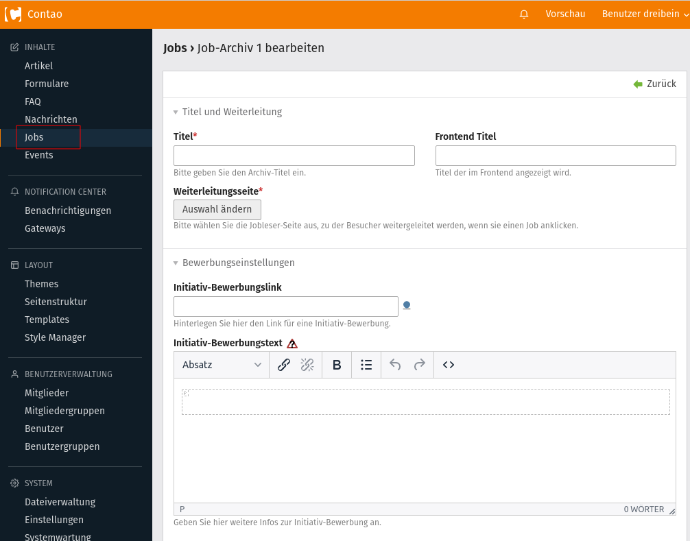

# Jobposting-Bundle

The contao jobposting bundle adds the ability to display and maintain job offers.

## Features

- Compatible with Contao 4.9 and higher (PHP 8 Support)
- Job-Archives and Job-Categories
- List- and Reader-Module to show the jobs in the frontend
- Own content element to show a specific job in the frontend
- Every job has its own unique link
- JSON+LD is generated for its job 

## Dependencies

- PHP: `>=7.4`
- Contao: `^4.9`

## Installation

**Via Composer**
```shell
$ composer require xirdion/contao-jobposting-bundle
```

**Via Contao Manager**

The jobletter-bundle can also be installed via the Contao Manager.

## Aufbau

Nach der Installation steht im Backend der neuer Menüeintrag `Jobs` zur Verfügung.
Über diesen Menüpunkt lassen sich die Job-Archive verwalten.
Auch zu den Job-Kategorien und den einzelnen Jobs pro Archiv gelangt man über diesen Menüpunkt.

### Job-Archiv
Das Job-Archiv kann mit einem Nachrichten-Archiv von Contao verglichen werden.
Dort kann man logisch zusammengehörende Jobs sammeln.

Es können folgende Daten angegeben werden:
- Titel
- Frontend-Titel
- Weiterleitungsseite zur dazugehörigen Job-Reader-Seite
- Archiv-weiter Link für eine Initiativ-Bewerbung (*kann pro Job überschrieben werden*)
- Archiv-weiter Text für eine Initiativ-Bewerbung (*kann pro Job überschrieben werden*)



### Job-Kategorie

Die Job-Kategorien erweitern die Filter-Möglichkeit der Jobs.
Es können unterschiedliche Kategorien erzeugt werden und den einzelnen Jobs zugeordnet wreden.
Im Modul `Jobliste` soll es zukünftig möglich sein, z. B. nur Jobs bestimmter Kategorien darzustellen.

Bei einer Kategorie können bereits folgende Daten angegeben werden:
- Titel
- Alias
- Frontend-Titel
- Beschreibung
- Bild
- Weiterleitungsseite

### Job
Die einzelnen Jobs kann man mit den News-Beiträgen von Contao vergleichen.
Es können wichtige Metadaten angegeben werden, die für die schema.org Ausgabe für die Google-Suche wichtig sind.
Des Weiteren können innerhalb eines Jobs beliebige Content-Elemente hinzugefügt werden.

Pro Job kann man einen eindeutigen Bewerbungslinks hinterlegen. Auch die Werte für die Initiativ-Bewerbung lassen sich hier überschreiben.
Neben der Möglichkeit einen Job zu veröffentlichen, kann man auch einstellen, ob man sich für einen Job bewerben kann oder nicht.
Somit hat man die Möglichkeit den Job zu veröffentlichen, auch wenn gerade nicht aktiv danach gesucht wird.

## Besonderheiten
Jobs werden in den Modulen und Content-Elementen nur über die \Contao\TemplateInheritance::insert() Funktion eingebunden.

**Job-Display:** (Content-Element)
```php
$this->insert('template_name', $this->job);
```

**Job-Reader:**
```php
$this->insert('template_name', $this->job);
```

**Job-List:**
```php
foreach ($this->jobs as $job) {
    $this->insert('template_name', $job);
}
```
